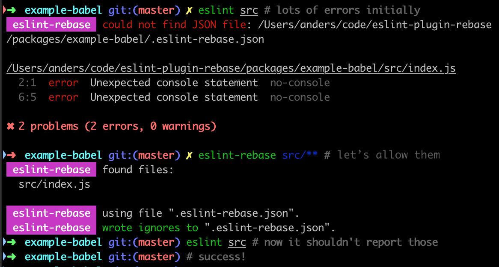

# eslint-plugin-rebase
> ⬣⬡ Start ESLinting new code, without fixing all the old.


Ever wanted to introduce and enforce new ESLint rules to your project, but noticed too many errors in existing code?
Maybe you didn't have time to fix everything, so you gave up.
So even new code is being added that might violate the rules you had wanted.

But what if you could whitelist all existing violations, and have ESLint only report on new or changed code?

`eslint-plugin-rebase` empowers you to do exactly that!

## Get Started

```shell
npm add -D eslint-plugin-rebase
```

Use our CLI to initialize, pointing it to your source files:

```shell
eslint-rebase src/**
```

This creates a `.eslint-rebase.json` file that looks something like this (though you may have no `ignores` initially):

```json
{
  "ignores": {
    "src/index.js::console.log('ok');": true,
    "src/index.js::console.log(\"oops\");": true
  }
}
```

This `.eslint-rebase.json` file should be commited to your repository.

Suppose you consider adding a new rule to your ESLint config (e.g., `no-console`).
If you run `eslint`, you may see many existing violations.
If you want to whitelist them, run `eslint-rebase` again, and they will be written to `ignores` in `.eslint-rebase.json`.
Running `eslint` again, you'll see it passes with no errors.



But now if you were to write any new code (or change any existing lines) that violate this new rule,
you'll see those new lines start to report errors.


## Prior Art

Tools like [disable-eslint-issues-cli](https://github.com/akonchady/disable-eslint-issues-cli) and [suppress-eslint-errors](https://github.com/Faithlife/suppress-eslint-errors)
let you add `eslint-disable` comments to each violation in your source code,
but that can be noisy and invasive, may encourage copy/pasting of disable comments along with code,
and even make disabling seem acceptable (rather than an exception to be used as sparingly as is feasible).
